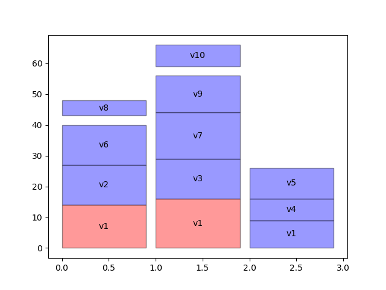

# Task Scheduler based on Machine Learning


```
$ python mlscheduler --usecase GASchedulerTestUseCase
```

```
Params: w=0.99, nind=150, max_terminate=150, no_change_terminate=20, vm_base=0.1, alpha=1, beta=1, k1=0.6, k2=0.8, k3=0.1, k4=0.05
```

## Installation
Make sure that you have installed Python & pip:  
- Arch `pacman -S python pip`  
- Debian `apt-get install python pip`  

Install project dependencies  
```
$ python setup.py install
```

## Run
```
$ python mlscheduler
```  
or you can run different use case, eg.:  
```
$ python mlscheduler --usecase TaskGraphTestUseCase
```

## Documentation
https://docs.google.com/document/d/1lBDyZDCdKzHCiU_8dVA5i5CjWB9K9qG_kVSg863GKdU

## Useful links
- Trello board (https://trello.com/b/WlySl9JH/bsc)  
- Data flow (https://www.draw.io/#G0B8iyR5YUITZYQXRPRnc5OWtQQ3M)